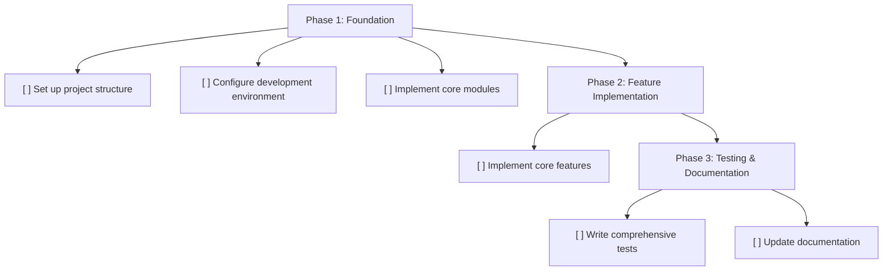

# Project Roadmap: Project Rules Generator

High-level roadmap for project development

---

## Roadmap Diagram

---

## Task Details

## Phase 1: Foundation

Set up core infrastructure and architecture

- [ ] Set up project structure
  - [ ] Create directory layout
  - [ ] Initialize configuration

- [ ] Configure development environment
  - [ ] Set up linting
  - [ ] Configure testing framework

- [ ] Implement core modules
  - [ ] Create base classes
  - [ ] Set up utilities

## Phase 2: Feature Implementation

Implement main features

- [ ] Implement core features
  - [ ] Design API
  - [ ] Write implementation
  - [ ] Add tests

## Phase 3: Testing & Documentation

Ensure quality and document the project

- [ ] Write comprehensive tests
  - [ ] Unit tests
  - [ ] Integration tests
  - [ ] E2E tests

- [ ] Update documentation
  - [ ] API docs
  - [ ] User guide
  - [ ] Examples
