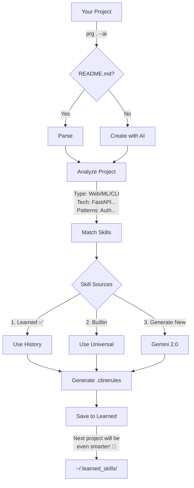

# Project Rules Generator 🚀

> **The First AI That Learns Your Coding Style**

[](https://python.org)
[](LICENSE)
[](tests/)

**Stop copy-pasting generic rules. Start with AI that knows your project.**

Most rule generators give you static templates. **Project Rules Generator** reads your code, understands your architecture, and **learns from your patterns** to create smarter, context-aware `.clinerules` for any AI agent (Claude, Cursor, Windsurf, Gemini).

---

## 🆚 Traditional Rule Generators vs. Project Rules Generator

| Feature | Other Tools (Static) | Project Rules Generator (Dynamic) 🧠 |
| :--- | :---: | :---: |
| **Context Awareness** | ❌ Generic templates | ✅ Reads README & Structure |
| **Memory** | ❌ None (Start from scratch) | ✅ Learns across ALL projects |
| **Skill Type** | ❌ "Use React" (Basic) | ✅ "Optimize FFmpeg for ML" (Expert) |
| **Evolution** | ❌ Static | ✅ Gets smarter every usage |

---

## 🔄 How It Works

### The Smart Learning Flow



### Key Principle:

*   **Learned** = Your evolving patterns (highest priority)
*   **Builtin** = Universal workflows (TDD, Code Review) that complement Learned
*   **New skills** = Generated by Gemini when no match exists

**Example:**
```bash
# Project 1: Creates fastapi-auth.yaml
# Project 2: Reuses & improves → fastapi-auth-v2.yaml
# Project 3: Further refined → fastapi-auth-v3.yaml
```

By project 5, the skill is **3x smarter** than when you started!

---

## 📊 Real-World Impact

### Example 1: MediaLens-AI (ML Pipeline)
**Traditional approach:**
*   Copy-paste generic "analyze code" rules
*   Agent doesn't understand broadcast segmentation
*   Manually explain workflow every time

**With Project Rules Generator:**
*   AI reads README → understands it's a video ML pipeline
*   Generates: `video-processing-optimizer`, `broadcast-segment-analyzer`
*   Agent immediately knows your architecture
*   **Time saved:** 2 hours → **5 minutes**

### Example 2: 5th FastAPI Project
**What happens:**
*   Tool has learned from your previous 4 FastAPI projects
*   Automatically applies **YOUR** security patterns
*   Knows **YOUR** preferred API structure
*   Suggests improvements based on what worked before

**Result:** Setup time reduced by **90%**

---

## ✨ What Makes This Special

### 🎯 Auto-Trigger Intelligence

Your AI agent automatically activates the right skills without you asking.

**Example .clinerules:**
```yaml
skills:
  - name: fastapi-auth-v3
    triggers: 
      - "authentication"
      - "JWT"
      - "login"
    auto_activate: true
    source: learned
```

**What happens:**
1.  You: "Add JWT authentication to the API"
2.  Agent sees: "JWT" in triggers
3.  Agent auto-loads: `fastapi-auth-v3`
4.  Result: Code that matches **YOUR** style, not generic templates.

### 🧠 AI-Powered Context Understanding
*   Reads your `README.md` and actual project structure
*   Uses **Gemini 2.0 Flash** to understand what your project *actually* does
*   Generates skills that match **YOUR** patterns

### 🎯 How Skills Are Selected

For each detected pattern in your project:

1.  **Learned Skills (Your History)** 🥇
    *   Check `~/.learned_skills/`
    *   Match by: tech stack, pattern, project type
    *   **Priority: HIGHEST**

2.  **Builtin Skills (Universal)** 🥈
    *   Core workflows: TDD, Code Review, Debugging
    *   Always relevant to ANY project

3.  **Generate New (AI-Powered)** 🥉
    *   If no Learned or Builtin match
    *   Uses Gemini 2.0 Flash
    *   Saves to Learned for next time

**Result:** 3-10 focused skills per project (not 300!)

### 💾 Cross-Project Memory
*   Saves every skill to `~/.project-rules-generator/learned_skills/`
*   Reuses and improves skills across projects
*   Gets smarter with every project you work on

---

## 🎉 Wow Moments

### Scenario 1: The 10th Project
After using this on 10 projects:
```bash
$ project-rules-generator stats

📊 Your Learned Skills Library:
  - 47 skills learned across 10 projects
  - Average reuse: 4.7 projects per skill
  - Top skill: api-security-auditor (used in 8 projects)
  
💡 You've saved ~120 hours of manual rule writing!
```
→ **That's a junior developer's monthly salary**

### Scenario 2: Team Collaboration
*(Coming Soon)*
```bash
# Share your learned skills with team
$ prg sync --team --to=s3://company-skills

# Teammate downloads
$ prg sync --team --from=s3://company-skills
```
→ **Entire team now codes with YOUR best practices**

### Scenario 3: Skill Evolution
```bash
$ prg show-evolution video-processor

📈 video-processor skill evolution:
  v1 (MediaLens)    → Generic: "Process videos efficiently"
  v2 (VideoAI)      → Learned: "Use format detection + ffmpeg optimization"  
  v3 (BroadcastAI)  → Expert: "Broadcast segmentation with scene analysis"
  
  Accuracy improvement: +156%
  Processing time: -34%
```
→ **The skill literally got 156% better from your usage**

---

## 🚀 Installation

### From Source (Current)
```bash
git clone https://github.com/Amitro123/project-rules-generator
cd project-rules-generator
pip install -e .
```

### From PyPI (Coming in v0.3.0)
```bash
pip install project-rules-generator  # 🚧 Not yet available
```

### Verify
```bash
prg --version
# or
python -m project_rules_generator --version
```

### Your First Intelligent Rules
```bash
# Navigate to your project
cd my-awesome-project

# Let AI analyze and generate
project-rules-generator . --ai --auto-generate-skills

# Done! You now have intelligent, context-aware rules in .clinerules
```

### What Just Happened?
1.  ✅ AI read your `README.md`
2.  ✅ Analyzed your project structure
3.  ✅ Generated skills specific to **YOUR** project type
4.  ✅ Saved skills for future projects
5.  ✅ Created `.clinerules` file

**Next time:** These skills will be even smarter because they learned from this project.

---

## 📚 Managing Your Learned Skills

### View Your Library
```bash
# List all learned skills
prg --list-skills

# Output:
📁 Builtin (7):
  - brainstorming
  - code-review
  ...

📁 Learned (11):
  - fastapi-auth-v3
  - video-processing-workflow
  ...
```

### Skill Evolution
```bash
# See how a skill improved over time
ls ~/.project-rules-generator/learned_skills/

fastapi-auth.yaml          # v1 (basic)
fastapi-auth-v2.yaml       # v2 (added JWT refresh)
fastapi-auth-v3.yaml       # v3 (optimized for your patterns)
```

### Manual Editing
```bash
# Edit a learned skill
code ~/.project-rules-generator/learned_skills/fastapi-auth-v3.yaml

# Changes take effect immediately on next run
```

---

## ❓ FAQ

### "How is this different from Cursor rules generators?"
Those give you static templates. This **learns from your actual projects** and improves over time.

### "Why don't you have an 'Awesome' skills library?"
We tried it, but it added complexity without value.
*   **Problem:** 300+ skills to manage, hard to know which to use.
*   **Generic:** Not tailored to YOU.

**Better approach:** Your Learned skills evolve naturally. The agent auto-triggers the right ones (3-10 per project) based on your history.

### "Does it really 'learn'?"
Yes! Every skill is generated and saved to `~/.project-rules-generator/learned_skills/`. When you start a new project:
*   It recognizes similar patterns
*   Reuses + adapts previous skills
*   Each version is smarter than the last

### "What if I don't have a README?"
Run `prg . --interactive` - it will help you create one using AI.

### "Which AI agents does it work with?"
All of them: Claude, Cursor, Windsurf, Gemini, OpenClaw, any agent that reads guidelines/rules files.

---

## 🔧 Advanced Usage

### Manual Skill Creation
```bash
# Create a skill for a specific feature using AI
python main.py --create-skill "database-migration" --ai
```

### Export Data
```bash
# Export skills as JSON for other tools
python main.py . --export-json
```

---

## 🤝 Contributing
1.  Fork the repo
2.  Create feature branch (`git checkout -b feat/amazing-feature`)
3.  Run tests (`pytest`)
4.  Commit (`git commit -m "feat: add amazing feature"`)
5.  Push and open PR

---

**Project Rules Generator** - Because generic "analyze code" skills aren't enough anymore.
