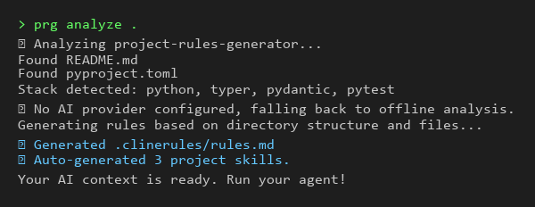
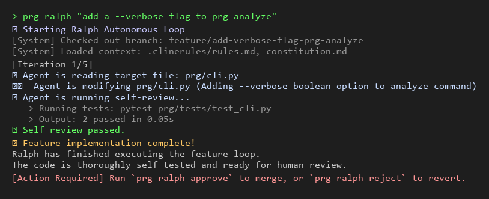

# Project Rules Generator

[](https://python.org)
[](LICENSE)
[](https://github.com/Amitro123/project-rules-generator/actions/workflows/ci.yml)

---

## The Problem

Every AI agent you use — Claude, Cursor, Windsurf, Copilot — starts every conversation knowing **nothing** about your project.

You explain your stack. Again. You correct the same bad patterns. Again. You watch it generate code that ignores your architecture. Again.

The AI isn't dumb. It's **context-blind.**

---

## The Solution

**Project Rules Generator (PRG)** generates structured memory artifacts for AI coding agents — rules, skills, plans, and specs that any agent (Claude, Cursor, Windsurf, Copilot) can consume.

Run it once. Every future AI session starts with project context: your stack, your conventions, your architecture, your do's and don'ts.

```bash
cd your-project
prg init .
```

Your `.clinerules/` is now the memory your AI agents never had. Generate the artifacts, then let any agent consume them — or optionally run Ralph to execute autonomously on top of them.

---

## What Gets Generated

PRG writes to two locations depending on which agent you use:

```text
.agents/
└── rules/
    └── <project-name>.md     ← Auto-loaded by Claude Code / Windsurf (Always On)

.clinerules/
├── rules.json                ← Machine-readable rules (used by planning commands)
├── constitution.md           ← Non-negotiable principles — generated with --constitution
├── clinerules.yaml           ← Skill index for agents — generated when skills are present
└── skills/
    ├── index.md              ← Skills manifest (always generated)
    ├── project/              ← AI-generated workflows tailored to YOUR project
    ├── learned/              ← Reusable patterns, shared across projects
    └── builtin/              ← Battle-tested best practices, bundled
```

### Why two locations?

**`.agents/rules/<project-name>.md`** is picked up automatically by Claude Code and Windsurf as an "Always On" workspace rule — no configuration needed. The agent receives your project's stack, architecture, and conventions at the start of every session without you having to paste anything.

**`.clinerules/`** is consumed by Cline and agents that follow the `.clinerules` convention. It also powers the full skill system (`prg design`, `prg plan`, `prg agent`).

See [`docs/structure.md`](docs/structure.md) for a full breakdown of every file.

**Offline baseline** (`prg analyze` with no API key): generates the agent rules file, `rules.json`, and `skills/index.md`. `constitution.md` requires `--constitution`; `clinerules.yaml` is written when skills are discovered.

**Project Lifecycle Generators (Optional):**
- `spec.md`: High-level Product Specifications and constraints (Goals, Stories).
- `DESIGN.md`: Phase 1 Architecture Document detailing technical integrations.
- `PLAN.md` & `TASKS.json`: Phase 2 AI-driven granular task decomposition.

**Example output for a FastAPI project:**

```markdown
## FastAPI Rules (High Priority)
- Use async/await for ALL I/O — never block the event loop
- Pydantic models for every request/response body, no raw dicts
- Use Depends() for injection — never pass dependencies manually

## Testing Rules
- pytest fixtures for all setup; parametrize for edge cases
- Mock at boundaries only (APIs, DB) — never internal logic
```

No templates. No hand-holding. Generated from *your actual project.*

---

## Quick Start

**No API key needed** — `prg init` and `prg analyze` work fully offline from your README and file structure:

```bash
pip install project-rules-generator
prg init .
prg analyze .
```

**With a free API key** — LLM-generated skills, richer analysis, and the planning commands:

```bash
export GROQ_API_KEY=gsk_...   # free at console.groq.com
prg analyze . --ai
prg design "Add OAuth2 login"   # requires API key
prg plan "Add OAuth2 login"     # requires API key
```

| Command | Offline | Requires API key |
|---------|:-------:|:----------------:|
| `prg init` / `prg analyze` | ✓ | — |
| `prg watch` | ✓ | — |
| `prg design` / `prg plan` | — | ✓ |
| `prg review` | — | ✓ |
| `prg analyze --ai` | — | ✓ |

**Housekeeping** — PRG ships a tiny helper to purge the Python bytecode cache on Windows:

```powershell
pwsh ./clean.ps1   # removes __pycache__/, *.pyc, *.pyo, .pytest_cache/
```

On macOS/Linux: `find . -type d -name __pycache__ -exec rm -rf {} +`.

**Optionally, run Ralph** — an autonomous execution loop that reads your generated artifacts and iterates until the feature is done:

```bash
prg feature "Add OAuth2 login"         # Set up feature branch + state
prg ralph run FEATURE-001              # Autonomous loop (no per-task prompts)
prg ralph approve FEATURE-001          # Human approval → merge to main
```

---

## Real Output Example

**Without PRG:** You ask an AI agent to "add a user login endpoint". It generates synchronous SQLAlchemy queries, uses raw dictionaries for responses, and dumps the route in `main.py`.
**With PRG:** The agent first reads your `.agents/rules/<project>.md` (or `.clinerules/`). It automatically uses async SQLAlchemy 2.0 syntax, creates a Pydantic response schema, and places the route correctly in `app/api/v1/endpoints/auth.py`.

Here is an example of what `prg analyze` actually generates from a real Python FastAPI + React + PostgreSQL codebase — no templates, just your project's exact reality:

```markdown
# FastAPI + React Web Stack Rules

## Core Architecture
- **Backend**: FastAPI 0.100+, SQLAlchemy 2.0 (async), Pydantic V2
- **Frontend**: React 18, TypeScript, TailwindCSS, Vite
- **Database**: PostgreSQL 15+ (accessed exclusively via asyncpg)

## Backend Conventions
- **Asynchronous I/O**: ALL database operations and external requests MUST use `async`/`await`. Never use synchronous `Session`.
- **Dependency Injection**: Always use FastAPI `Depends()` for database sessions (`get_db_session`) and current user state.
- **Routing**: API routes must be placed in `app/api/v1/endpoints/`. Organize by domain logic (e.g., `auth.py`, `users.py`).
- **Validation**: Strict use of Pydantic V2 schemas for all request/response models. No raw `dict` structures.

## Frontend Conventions
- **Components**: Functional components only, placed in `src/components/`. Enforce `PascalCase.tsx` naming.
- **Styling**: Tailwind utility classes exclusively. Keep `index.css` minimal.
- **Data Fetching**: Use React Query (`@tanstack/react-query`) for all backend API integration and caching.

## Testing Guidelines
- Use `pytest` and `pytest-asyncio` for backend tests in `tests/backend/`.
- Test against a real PostgreSQL test database using rollback-based transactional fixtures.
```

**PRG analyzing itself** — real terminal output, no staging:



---

## The 3-Layer Skill System

Skills are ranked by specificity. More specific always wins:

| Layer | Location | What It Contains | Written by | Priority |
|:------|:---------|:----------------|:-----------|:--------:|
| **Project** | `.clinerules/skills/project/` | Auto-generated by `prg analyze` from this project's README + context | README flow | Highest |
| **Learned** | `~/.project-rules-generator/learned_skills/` | Reusable skills captured explicitly — default target of `--create-skill` | `--create-skill` (default) | Medium |
| **Builtin** | `templates/skills/` (package-bundled) | Universal patterns (mypy, git, Python idioms) | `--scope builtin` | Lowest |

A project-level skill overrides the global one. Your patterns win.

**Skill scope routing:**
- `prg analyze` → writes to `project/` (project-context-aware, not reusable)
- `--create-skill` → writes to `learned/` by default (explicit capture = reusable)
- `--create-skill --scope builtin` → writes to `builtin/` for universal patterns

---

## AI Providers

PRG auto-detects the best available provider from your environment. Set one key, or set several — it routes intelligently.

| Provider | Model | Best For | Key |
|:---------|:------|:---------|:----|
| **Anthropic** | Claude Sonnet 4.6 | Highest quality rules & skills | `ANTHROPIC_API_KEY` |
| **OpenAI** | GPT-4o-mini | Solid all-rounder | `OPENAI_API_KEY` |
| **Gemini** | Gemini 2.0 Flash | Fast + high quality | `GEMINI_API_KEY` |
| **Groq** | Llama 3.1 8b | Free tier, fastest | `GROQ_API_KEY` |

No provider? `prg init` and `prg analyze` still work offline — README + file structure analysis is free and surprisingly smart. `prg design`, `prg plan`, and `prg review` require a key.

```bash
prg providers list       # See what's configured
prg providers test       # Live latency check
prg providers benchmark  # Side-by-side quality ranking
```

---

## See Ralph in Action

**PRG is not a chatbot — it is an autonomous loop that runs until the feature is done.**

Here is a 3-step look at Ralph autonomously resolving a feature request:
1. **Reads Context:** Automatically reads your `.agents/rules/<project>.md` and codebase structure without needing you to copy-paste.
2. **Executes & Self-Reviews:** Writes the code, tests its own work via your test suite, and refines if it breaks anything.
3. **Awaits Approval:** Checks the completed code into a branch and awaits human sign-off.



---

## All Features & Commands

### 🔍 1. Analysis & Generation

```bash
prg init .                                    # First-run wizard: detect stack, generate rules
prg analyze .                                 # Regenerate from README + file structure
prg analyze . --ai                            # AI-powered analysis (LLM-generated skills)
prg analyze . --incremental                   # Skip unchanged phases (README/deps/source tracked)
prg analyze . --constitution                  # Also generate constitution.md
```

### 🧠 2. Two-Stage Planning & Specs

> Requires an AI provider API key (`GEMINI_API_KEY`, `ANTHROPIC_API_KEY`, `GROQ_API_KEY`, or `OPENAI_API_KEY`).

```bash
prg design "Add OAuth2 login"                 # Stage 1: Generates DESIGN.md architecture document
prg plan   "Add OAuth2 login"                 # Stage 2: Generates PLAN.md + TASKS.json implementation plan
```

### 🛠️ 3. Skill Management

```bash
prg analyze . --create-skill "auth-flow" --ai             # Create a global learned/ reusable skill
prg analyze . --create-skill "mypy-types" --scope builtin # Create a universal builtin/ skill
prg skills list --all                                     # List project + learned + builtin skills
prg skills validate my-skill                              # Run quality checker (score must be ≥ 70)
prg skills feedback my-skill --useful                     # Record a useful vote for a skill
prg skills feedback my-skill --not-useful                 # Record a not-useful vote for a skill
prg skills stale                                          # List skills scoring below 30% with ≥3 votes
prg skills stale --threshold 0.5                          # Adjust the low-score threshold
```

Every `prg agent` match silently increments the skill's match count — no user action required. Use `prg skills feedback` after working with a skill, and `prg skills stale` periodically to find skills worth regenerating.

### 👁 4. Watch Mode

```bash
prg watch .                                   # Watch for changes and auto-run analyze --incremental
prg watch . --delay 5.0                       # Set debounce delay in seconds (default: 2.0)
prg watch . --ide cursor --quiet              # Specify IDE target, suppress non-error output
```

Monitors README.md, dependency manifests (pyproject.toml, package.json, Cargo.toml, go.mod, requirements*.txt), Dockerfile, docker-compose.yml, and all files under `tests/` directories. Uses a 2-second debounce to coalesce rapid saves and a re-entry guard to prevent overlapping runs. Stop with Ctrl+C.

### 🤖 5. Autonomous Orchestration (Optional)

These commands run on top of artifacts already generated by `prg analyze`, `prg design`, and `prg plan`. Generate your memory artifacts first, then optionally invoke an execution loop.

```bash
prg agent "fix a bug"                         # Smart Orchestration (Maps generic text to an exact skill)
prg review PLAN.md                            # AI Self-Review mode (Generates CRITIQUE.md scorecard)
prg feature "Add OAuth2 login"               # Set up feature branch for Ralph
prg ralph "Add OAuth2 login"                 # Ralph: autonomous feature loop (create + run immediately)
prg ralph run FEATURE-001                    # Ralph: run loop for an existing feature workspace
prg ralph approve FEATURE-001               # Human approval → merge to main
```

---

## How Analysis Works

```
prg analyze . --ai
        │
        ▼
  Read README + file structure
        │
        ▼
  Detect tech stack (45+ technologies)
  fastapi · react · pytest · sqlalchemy · docker · ...
        │
        ▼
  AIStrategyRouter
  ┌─────────────────────────────────────────┐
  │  Has API key?  →  CoworkStrategy (LLM)  │
  │  Has README?   →  READMEStrategy        │
  │  Fallback      →  StubStrategy          │
  └─────────────────────────────────────────┘
        │
        ▼
  Quality gate (score ≥ 85, configurable via --quality-threshold) → auto-retry if needed
        │
        ▼
  .agents/rules/<project-name>.md + .clinerules/ skills/
```

Rules are **scored** before they're written. Generic filler never makes it through.

---

## Installation

**From PyPI (recommended):**

```bash
pip install project-rules-generator
prg --version
```

**From source (contributors):**

```bash
git clone https://github.com/Amitro123/project-rules-generator
cd project-rules-generator
pip install -e .
prg --version
```

**Requirements:** Python 3.10+, Git

---

## Contributing

See [`CONTRIBUTING.md`](CONTRIBUTING.md) for the full guide: dev setup, how to add a command, how the skill system works, and testing rules.

```bash
pytest                              # run tests
black . && ruff check . && isort .  # format (required before commit)
```

See [`docs/index.md`](docs/index.md) for all documentation.

---

## License

MIT — see [`LICENSE`](LICENSE).

---

> Full version history: [`CHANGELOG.md`](CHANGELOG.md) · Architecture: [`docs/architecture.md`](docs/architecture.md) · Feature deep-dives: [`docs/features.md`](docs/features.md)
