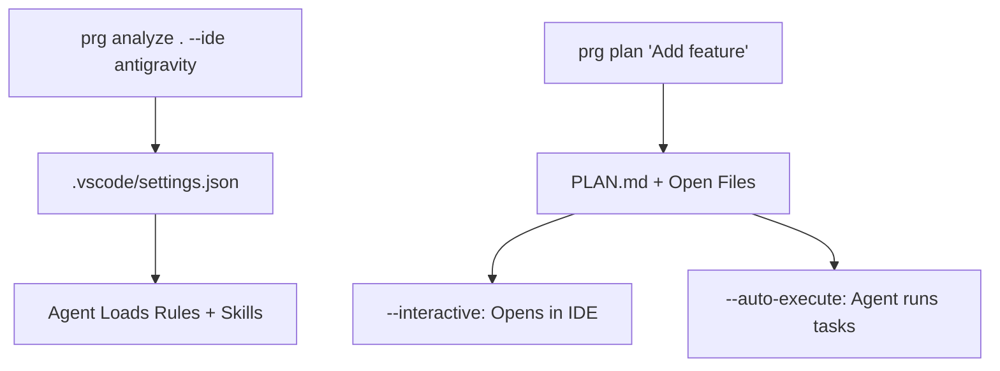

# Project Rules Generator 🚀

> **The First AI That Learns Your Coding Style**

[](https://python.org)
[](LICENSE)
[](tests/)

**Stop copy-pasting generic rules. Start with AI that knows your project.**

## Recent Changes (v1.1)
- **Skills cleanup**: Removed 2 legacy files (`skills_generator.py`, `skill_matcher.py`) — 258 lines eliminated
- **New `utils/`**: `tech_detector.py` + `quality_checker.py` — consolidated duplicate logic
- **Strategy Pattern**: `create_skill()` complexity reduced D→B (73% improvement)
- **Architecture docs**: See [`docs/architecture.md`](docs/architecture.md)

---

Most rule generators give you static templates. **Project Rules Generator** reads your code, understands your architecture, and **learns from your patterns** to create smarter, context-aware `.clinerules` for any AI agent (Claude, Cursor, Windsurf, Gemini).

---

## 🆚 Traditional Rule Generators vs. Project Rules Generator

| **Feature** | **Other Tools (Static)** | **Project Rules Generator (Dynamic) 🧠** |
| :--- | :---: | :---: |
| **Context Awareness** | ❌ Generic templates | ✅ Reads README & Structure |
| **Memory** | ❌ None (Start from scratch) | ✅ Learns across ALL projects |
| **Skill Type** | ❌ "Use React" (Basic) | ✅ "Optimize FFmpeg for ML" (Expert) |
| **Git Integration** | ❌ Manual | ✅ Auto-commits (Smart .gitignore handling) |
| **Constitution** | ❌ None | ✅ Generates `constitution.md` principles |
| **Incremental** | ❌ Full Regen Only | ✅ Updates only changed files/skills |
| **Context Opt.** | ❌ All or Nothing | ✅ Smart `.clinerules.yaml` exclusions |
| **Evolution** | ❌ Static | ✅ Gets smarter every usage |

---

## How It Works



---

##  User Guide
 
### 1. Basic Analysis
**What it does:** Scans your project structure and `README.md` to generate base rules without AI. Fast and private.
 
```bash
# Run in your project root
project-rules-generator .
```
 
**Output:** Generates `.clinerules/rules.md` with file structure and basic patterns.
 
### 2. AI-Powered Skills
**What it does:** Uses **Gemini 2.0 Flash** to deeply understand your project and generate custom skills.
 
```bash
# Requires GEMINI_API_KEY
project-rules-generator . --ai
```
 
**Scenario:** You have a unique video processing pipeline. The AI reads your code and creates a `video-pipeline-expert` skill automatically.
 
### 3. Incremental Mode ⚡
**What it does:** Updates only what has changed since the last run. Perfect for CI/CD or frequent updates.
 
```bash
project-rules-generator . --incremental
```
 
### 4. Constitution Mode 📜
**What it does:** Generates a `constitution.md` file containing your project's core coding principles and headers.
 
```bash
project-rules-generator . --constitution
```
 
### 5. Skill Management 📚
**What it does:** Manages your personal library of learned skills.
 
```bash
# List all skills
prg --list-skills
 
# Create a new skill manually with AI assistance
prg --create-skill "database-migration" --ai
```

### 6. Autopilot 🤖
**What it does:** Full autonomous mode. Discovers project, plans tasks, and executes them with git safety.

```bash
prg autopilot .
```
-   **Discovery**: Analyzes & Plans.
-   **Execution**: Branches -> Implements -> Verifies -> Merges.

 
---
 
## 🌊 Common Workflows
 
###  Initial Setup
Run this once when setting up a new project or onboarding.
```bash
# Full generation with Constitution and AI skills
prg . --ai --constitution --full-workflow
```
 
### 💻 Daily Development
Run this when you add new dependencies or change project structure.
```bash
# Fast incremental update
prg . --incremental
```
 
### 🚀 CI/CD Integration
Add this to your GitHub Actions to ensure rules are always up to date.
```bash
# In .github/workflows/update-rules.yml
- run: pip install project-rules-generator
- run: prg . --incremental --no-commit
```
 
### 🤝 Team Onboarding
Share your team's best practices.
```bash
# Export skills to a shared location
prg . --export-json > team-skills.json
```

---

## ⚡ Feature Comparison
 
| Mode | Speed | AI Required | Output |
| :--- | :--- | :--- | :--- |
| **Basic** (`prg .`) | 🚀 ~200ms | ❌ No | `.clinerules/rules.md` |
| **Incremental** (`--incremental`) | ⚡ ~50ms | ❌ No | Updated changes only |
| **Two-Stage Planning** | 🐢 ~60s | ✅ Yes | `DESIGN.md` + `PLAN.md` |
| **Interactive Plan** (`--interactive`) | 🐢 ~60s | ✅ Yes | Opens files in IDE |
| **Constitution** (`--constitution`) | 🚀 ~200ms | ❌ No | `constitution.md` |
| **AI Skills** (`--ai`) | 🐢 ~30s | ✅ Yes (Gemini) | Custom `skills/*.md` |
| **Full Workflow** | 🐢 ~35s | ✅ Yes | All of the above |
 
---
 
## 🛠️ CLI Reference
 
| Flag | Description | Default |
| :--- | :--- | :--- |
| `project_path` | Target directory to analyze | `.` (Current) |
| `--ai` | Enable Gemini 2.0 to generate skills | `False` |
| `--incremental` | Update only changed files | `False` |
| `--constitution` | Generate core principles file | `False` |
| `--full-workflow` | Run all steps (Const + AI + Rules) | `False` |
| `--no-commit` | Skip git commit | `False` |
| `--output DIR` | Custom output directory | `.clinerules` |
| `--list-skills` | Show your learned skills library | `False` |
| `--export-json` | Export skills for team sharing | `False` |
| `--eval-opik` | Log traces to Comet Opik | `False` |

### `prg plan` Flags

| Flag | Description | Default |
| :--- | :--- | :--- |
| `TASK_DESCRIPTION` | What to build (e.g. "Add Redis cache") | — |
| `--from-design` | Generate plan from a DESIGN.md file | — |
| `--interactive` | Open files in IDE as tasks are listed | `False` |
| `--auto-execute` | Agent creates files and opens them automatically | `False` |
| `--provider` | AI provider (`gemini`, `groq`) | Auto-detect |
| `agent "query"` | Simulate auto-trigger matching | — |

### Task Automation 🆕

| Command | Description |
| :--- | :--- |
| `prg autopilot` | **Autonomous Agent**: Full Discovery (Analyze/Rules) → Planning → Execution loop. |
| `prg start "task"` | **Fast Setup**: Plan → Tasks → Preflight → Auto-Fix → Ready for work. |
| `prg setup "task"` | Setup only (generates plan & tasks) without execution prompt. |
| `prg manager` | **Project Manager**: 4-Phase Lifecycle (Setup -> Verify -> Copilot -> Report). |
| `prg exec tasks/001-*.md` | Execute specific task file. Options: `--complete` or `--skip`. |
| `prg status` | Show progress table (reads `TASKS.yaml` or falls back to `PlanParser`). |

---

##  Output Structure
 
All generated files are consolidated into a single `.clinerules/` directory inside your project:
 
```
.clinerules/
├── rules.md              # Main rules (from any mode)
├── constitution.md       # Code principles (when --constitution)
├── clinerules.yaml       # Lightweight YAML skill references
└── skills/
    ├── project/          # Project-specific overrides (Highest Priority)
    ├── learned/          # Global learned skills (Medium Priority)
    └── builtin/          # Core PRG skills (Lowest Priority)
```
 

### 🎯 Smart Skill Orchestration 🆕

PRG doesn't just list skills; it helps agents use them automatically.

#### 1. Auto-Triggers
Every skill can define an `## Auto-Trigger` section with phrases that activate it.
When you run `prg analyze`, these triggers are extracted into a high-speed lookup file: `.clinerules/auto-triggers.json`.

**Example Skill (`readme-improver.md`):**
```markdown
## Auto-Trigger
- "improve README"
- "add badges"
- "documentation is missing"
```

#### 2. Agent Integration (`prg agent`)
Agents can query this system to find the right tool for the job without hallucinating.

```bash
$ prg agent "I need to improve the documentation"
🎯 Auto-trigger: readme-improver
```

#### 3. 3-Layer Architecture
PRG resolves skills in this order:
1.  **Project (`.clinerules/skills/project/`)**: High priority overrides.
2.  **Global Learned (`~/.project-rules-generator/learned/`)**: Your personal library.
3.  **Builtin (`~/.project-rules-generator/builtin/`)**: Default best practices.

**Resolution Logic:**
When an agent requests a skill (e.g., `fastapi`), PRG looks in `project` -> `learned` -> `builtin`.
 
### 📄 JSON Artifacts (`--export-json`)
When you run with `--export-json`, the tool generates `index.json`. This file contains structured data about every skill, including:
- **Triggers**: When the skill should be activated.
- **Process**: The step-by-step logic.
- **Source**: Whether it's `builtin` or `learned`.

**Why use it?**
- **Team Sharing**: Import this JSON into other agent tools or dashboards.
- **Meta-Analysis**: Use scripts to analyze your team's skill coverage.
- **IDE Integration**: Some IDEs ingest JSON rules better than Markdown.

### 🛡️ Special Rules Explained

#### **Encoding Safety**
*Required when using AI clients in Python.*

**The Rule:**
> "When handling AI responses, ALWAYS explicitly clean encoding artifacts and strip common corruptions."

**Why?**
AI models sometimes generate "ghost" characters like `ג€”` (a corrupted em-dash) or `ג` due to tokenization/encoding mismatches, especially on Windows terminals. These break downstream parsers.

**Example Fix:**
```python
# ❌ BAD
return response.text

# ✅ GOOD (Project Standard)
text = response.text.encode('utf-8', errors='replace').decode('utf-8')
text = text.replace('ג€”', '—').replace('ג', '')
return text.strip()
```
 
---
 
## 💡 Tips & Best Practices
 
1.  **Start with Constitution**: Run `prg . --constitution` first to establish core headers and principles.
2.  **Review Learned Skills**: Check `~/.project-rules-generator/learned_skills/`. Feel free to edit them manually!
3.  **Commit .clinerules**: Add the `.clinerules/` directory to git so your team shares the same brain.
4.  **Use Context Optimization**: If analysis is slow, check `.clinerules.yaml` and add huge folders to `exclude`.
5.  **Iterate Often**: Run `prg . --incremental` after adding major features or dependencies.
 
---
 
##  Installation
 
### From Source (Current)
```bash
git clone https://github.com/Amitro123/project-rules-generator
cd project-rules-generator
pip install -e .
```
 
### Verify
```bash
prg --version
```
 
---

## 🤝 Contributing
1.  Fork the repo
2.  Create feature branch (`git checkout -b feat/amazing-feature`)
3.  Run tests (`pytest`)
4.  Commit (`git commit -m "feat: add amazing feature"`)
5.  Push and open PR

---

**Project Rules Generator** — Because generic "analyze code" skills aren't enough anymore.