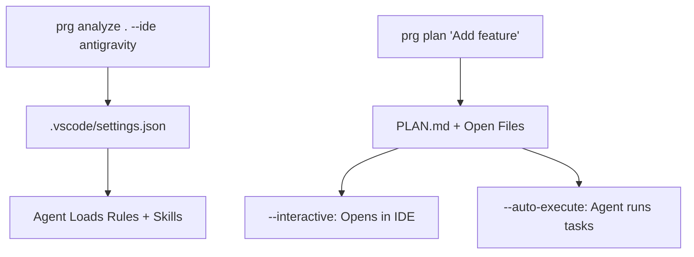

# Project Rules Generator 🚀

> **The First AI That Learns Your Coding Style**

[](https://python.org)
[](LICENSE)
[](tests/)

Most rule generators give you static templates. **Project Rules Generator (PRG)** reads your code, understands your architecture, and **learns from your patterns** to create smarter, context-aware `.clinerules` for any AI agent (Claude, Cursor, Windsurf, Gemini).

---

## Table of Contents
- [Features](#features)
- [Quick Start](#quick-start)
- [Installation](#installation)
- [Usage](#usage)
- [How It Works](#how-it-works)
- [Recent Changes](#recent-changes)
- [Contributing](#contributing)

---

## Features
- **Context Awareness**: Reads your README & structure instead of using generic templates.
- **Memory**: Learns across ALL projects, not just one.
- **Expert Skills**: Generates advanced rules like "Optimize FFmpeg for ML" instead of just "Use React".
- **Git Integration**: Auto-commits changes with smart `.gitignore` handling.
- **Constitution**: Automatically generates project `constitution.md` principles.
- **Incremental**: Fast! Updates only changed files or skills.
- **Context Optimization**: Smart `.clinerules.yaml` exclusions.

---

## Quick Start
Get PRG running and generate your basic project rules in your current directory:

```bash
project-rules-generator .
```
*This generates `.clinerules/rules.md` with your file structure and basic patterns in ~200ms.*

---

## Installation

### Prerequisites
- Python 3.11 or higher
- Git

### From Source (Current)
```bash
git clone https://github.com/Amitro123/project-rules-generator
cd project-rules-generator
pip install -e .
```

Verify the installation:
```bash
prg --version
```

---

## Usage

### 1. AI-Powered Custom Skills
Uses **Gemini 2.0 Flash** to deeply understand your project and generate custom skills. (Requires `GEMINI_API_KEY`).

```bash
prg . --ai
```
*Example: If you have a unique video processing pipeline, the AI reads your code and creates a `video-pipeline-expert` skill automatically.*

### 2. Incremental Update ⚡
Updates only what has changed since the last run. Perfect for CI/CD or frequent updates.

```bash
prg . --incremental
```

### 3. Constitution Mode 📜
Generates a `constitution.md` file containing your project's core coding principles and headers.

```bash
prg . --constitution
```

### 4. Skill Management 📚
Manage your personal library of learned skills.

```bash
prg --list-skills
prg --create-skill "database-migration" --ai
```

### 5. Autopilot 🤖
Full autonomous mode. Discovers your project, plans tasks, and executes them with git safety.

```bash
prg autopilot .
```

---

## How It Works

PRG operates on a 3-layer architecture for skill resolution:
1. **Project** (`.clinerules/skills/project/`): High priority overrides.
2. **Global Learned** (`~/.project-rules-generator/learned/`): Your personal library.
3. **Builtin** (`~/.project-rules-generator/builtin/`): Default best practices.



### Output Structure
All generated files are consolidated into a single `.clinerules/` directory inside your project:
```text
.clinerules/
├── rules.md              # Main rules (from any mode)
├── constitution.md       # Code principles (when --constitution)
├── clinerules.yaml       # Lightweight YAML skill references
└── skills/
    ├── project/          # Project-specific overrides (Highest Priority)
    ├── learned/          # Global learned skills (Medium Priority)
    └── builtin/          # Core PRG skills (Lowest Priority)
```

---

## Recent Changes

### v1.2
- **Bug fixes** (Issue #17): 5 bugs fixed in the Skills Mechanism
- **Design improvements**: `QualityReport` unified to single source, `any(rglob(...))` replaces `list(rglob(...))`.
- **New tests**: 10 focused regression tests (380 total passing).

### v1.1
- **Skills cleanup**: Removed 2 legacy files (`skills_generator.py`, `skill_matcher.py`).
- **New `utils/`**: `tech_detector.py` + `quality_checker.py`.
- **Strategy Pattern**: `create_skill()` complexity reduced by 73%.

> See [`CHANGELOG.md`](CHANGELOG.md) for full details.

---

## Contributing
We welcome contributions!
1. Fork the repo
2. Create your feature branch (`git checkout -b feat/amazing-feature`)
3. Run tests before committing (`pytest`)
4. Commit your changes (`git commit -m "feat: add amazing feature"`)
5. Push to the branch and open a PR.

---

**Project Rules Generator** — Because generic "analyze code" skills aren't enough anymore.