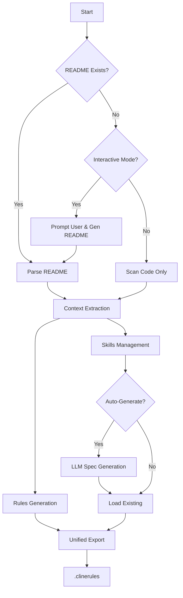

# Project Rules Generator 🚀

**Generate unified detector-response rules and AI agent skills from your project context.**

> **New in v0.2.0**: 
> - 🧠 **AI-Powered Skills**: Auto-generate skills using Gemini 2.0 Flash (`--ai`).
> - 🔗 **Unified Rules**: Create a single `.clinerules` file combining project context and active skill triggers.
> - 🔎 **Smart Context**: Analyzes project structure and workflows to suggest relevant skills.

[](https://python.org)
[](LICENSE)
[](tests/)
[](config.yaml)

## 🎯 What It Does

Turn any project's `README.md` into:
- **rules.md** - Coding standards, DO/DON'T, workflows
- **skills.md** - AI agent capabilities tailored to your project type

No more generic "analyze code" - get skills like:
- `video-processing-optimizer` for ML projects
- `api-endpoint-analyzer` for web apps
- `prompt-optimizer` for AI agents

## ✨ Key Features

- 🧠 **Smart Detection** - Identifies project type (web app, CLI, ML pipeline, agent, library)
- 🎨 **Domain-Specific Skills** - Generates relevant skills, not generic templates
- 🔧 **Dual Interface** - CLI for automation, IDE-agent for interactive use
- 📊 **High Confidence** - Multi-signal detection with confidence scores
- ⚙️ **Configurable** - YAML config for LLM enhancement, git settings
- � **Context-Aware Rules**: Generates `.cursorrules`, `.windsurfrules`, and generic `project-rules.md` based on your tech stack.
- ⚡ **Smart Skill Orchestration**: Automatically suggests relevant skills (agents) based on your project dependencies (e.g., "React Expert" if `package.json` has React).
- 🧩 **Modular Skills System**:
  - **Builtin**: Core workflows (TDD, Debugging, Code Review) shipped with the tool.
  - **Awesome**: Curated skills from top open-source projects.
  - **Learned**: Custom skills generated from your project's own documentation (`learned_skills/`).
- 🔍 **Audit & Fix**: Analyzes your project for common issues and security vulnerabilities (Bandit, Safety).
- �🧪 **Tested** - Unit tests + verified on real projects
- 🎯 **Smart Skill Orchestration** - Combines skills from built-in, awesome-agent-skills, and your learned library
- 🔄 **Skill Reuse** - Save and reuse adapted skills across projects
- 🏆 **Conflict Resolution** - Intelligent priority system (learned > awesome > built-in)

## 🎯 Smart Skill Orchestration

The tool discovers and combines skills from multiple sources, creating a comprehensive skill set tailored to your project:

### Skill Sources

1. **Built-in Skills** - Core skills for all projects (code analysis, refactoring, testing)
2. **Awesome Agent Skills** - Community-curated skills from external repositories
3. **Learned Skills** - Skills you've created or adapted in previous projects

### How It Works

```text
Analyze Project
├─ Tech stack (FastAPI, React, PyTorch...)
├─ File structure (Dockerfile, requirements.txt...)
└─ Project type (ML Pipeline, Web App, Agent...)

Discover Skills
├─ Built-in: templates/skills/
├─ Awesome: ~/awesome-agent-skills/
└─ Learned: ~/.project-rules-generator/learned_skills/

Match & Rank
└─ Score each skill based on relevance to your project

Resolve Conflicts
└─ Priority: Learned > Awesome > Built-in

Adapt & Output
└─ Fill project-specific context and generate skills.md
```

### Priority Resolution

When the same skill exists in multiple sources:
- **Learned skills** win (your customized version)
- **Awesome skills** override built-in (community best practices)
- **Built-in skills** serve as fallback

**Example:**
`fastapi-security-auditor` exists in:
1. Built-in (generic)
2. **Awesome** (community best practices) ← **This wins!**

## 🔄 How It Works

### Complete Flow Diagram



### Steps

1.  **Project Analysis**: Scans structure, tech stack, and workflows.
    *   *New*: If `README.md` is missing, use `--interactive` to generate one with AI.
2.  **Context Extraction**: Pulls rules, patterns, and conventions from your documentation and code.
3.  **Skills Management**:
    *   Loads **Builtin** skills (universal best practices).
    *   Loads **Awesome** skills (community curated).
    *   Loads **Learned** skills (your custom patterns).
    *   *Auto-Generates* missing skills using Gemini 2.0 Flash (if `--auto-generate-skills` is used).
4.  **Auto-Trigger Extraction**: Maps keywords (e.g., "fastapi") to relevant skills.
5.  **Unified Export**: Combines everything into a single `.clinerules` file for your agent.

### Priority Resolution
When the same skill exists in multiple sources:
1.  **Learned** (Highest Priority) - Your custom overrides.
2.  **Awesome** - Community best practices.
3.  **Builtin** - Default fallbacks.

## 🚀 Quick Start

### Installation

1. Clone the repository:
   ```bash
   git clone https://github.com/Amitro123/project-rules-generator
   cd project-rules-generator
   ```

2. Install the package in editable mode:
   ```bash
   pip install -e .
   ```

### Basic Usage

After installation, you can run the generator from any directory:

```bash
project-rules-generator [OPTIONS] [PROJECT_PATH]
```

Or for development (if not installed):
```bash
python main.py [OPTIONS] [PROJECT_PATH]
```

## ⚡ Quick Start

### 1. Unified Generation (Recommended)
Generate a `.clinerules` file containing project rules and active skill triggers:

```bash
# Basic usage (uses builtin/learned skills)
python main.py . --with-skills

# With AI-powered skill auto-generation (Requires GEMINI_API_KEY)
python main.py . --ai --auto-generate-skills
```

### 2. Manual Skill Creation
Create a custom skill tailored to your project:

```bash
# Create skill from prompt + project context analysis
python main.py --create-skill "feature-name" --ai

# Create skill from README context
python main.py --create-skill "data-pipeline" --from-readme docs/pipeline.md
```

### 3. Legacy / Separate Files
Generate separate `rules.md` and `skills.md`:

```bash
python main.py . --output rules.md
```

### Advanced Options

```bash
# Save newly generated skills to your learned library
python main.py /path/to/project --save-learned

# Use only specific skill sources
python main.py /path/to/project --source builtin
python main.py /path/to/project --source awesome
python main.py /path/to/project --source learned

# Export in multiple formats
python main.py /path/to/project --export-json --export-yaml
```

## 📚 Skill Library Management

### Learned Skills Directory

Your customized skills are stored in:
```text
~/.project-rules-generator/
└── learned_skills/
    ├── video-pipeline-reviewer.yaml
    ├── gemini-api-reviewer.yaml
    └── custom-skill.yaml
```

### Viewing Your Library

```bash
# List all learned skills
ls ~/.project-rules-generator/learned_skills/

# View a specific skill
cat ~/.project-rules-generator/learned_skills/video-pipeline-reviewer.yaml
```

### Editing Skills

Skills are stored as YAML - edit them directly:

```bash
code ~/.project-rules-generator/learned_skills/video-pipeline-reviewer.yaml
```

Changes take effect immediately on the next run.

### Sharing Skills

Share your best skills with the community:

```bash
# Copy skill to a shared repository
cp ~/.project-rules-generator/learned_skills/my-awesome-skill.yaml \
   ~/awesome-agent-skills/skills/custom/
```

### Example Output

Running on **MediaLens-AI** (video analysis project):
```
Detected: ml_pipeline (confidence: 100%)
```

**Generated Skills:**
- ✅ `video-processing-optimizer` - Tune ffmpeg parameters
- ✅ `broadcast-segmentation-analyzer` - Evaluate scene splitting
- ✅ `embedding-quality-tester` - Improve semantic search
- ✅ `prompt-optimizer` - Enhance AI prompts

## 📦 Project Types Supported

| Type | Detection Signals | Example Skills |
|------|-------------------|----------------|
| **Agent** | LLM APIs (Gemini, OpenAI), orchestration | `prompt-optimizer`, `llm-api-cost-analyzer` |
| **ML Pipeline** | PyTorch, video processing, training | `model-performance-analyzer`, `video-processing-optimizer` |
| **Web App** | FastAPI, React, REST APIs | `api-endpoint-analyzer`, `frontend-backend-sync` |
| **CLI Tool** | Click, argparse, command-line | `command-analyzer`, `cli-test-generator` |
| **Library** | Package structure, no main.py | `api-design-reviewer`, `documentation-sync` |
| **Generator** | Templates, scaffolding | `template-optimizer`, `self-improve` |

## 🎨 How It Works

1. **README Parser**  
   ↓ (extracts name, tech, features)
2. **Project Type Detector**  
   ↓ (AI agent? Web app? ML pipeline?)
3. **Domain Template Selector**  
   ↓ (loads relevant skill templates)
4. **Smart Generator**  
   ↓ (customizes for YOUR project)
5. **Output**: `rules.md` + `skills.md`

## ⚙️ Configuration

Edit `config.yaml` to customize behavior:

```yaml
llm:
  enabled: false  # Enable for deeper analysis via API
  provider: "gemini"  # or "anthropic"

git:
  auto_commit: true
  commit_message: "🤖 Auto-generated project docs"

generation:
  verbose: false
```

## 🧪 Testing

```bash
# Run all tests
pytest tests/

# Test specific detection logic
pytest tests/test_ai_video_detection.py -v

# Run generator on sample project
python main.py tests/test_samples/sample-project
```

## 🔧 IDE Agent Integration

### Antigravity / Claude / Gemini / Cursor
Load skills by prompting:
> "Load skills from {project}-skills.md and help me refactor the API layer"

### OpenClaw
```bash
/skills load medialens-ai-skills.md
```

### Manual
Reference the generated files as context for any AI agent.

## 📊 Real-World Examples

| Project | Detected Type | Skills Generated |
|---------|---------------|------------------|
| **MediaLens-AI** | `ml_pipeline` | `video-processing-optimizer`, `broadcast-segmentation-analyzer` |
| **DevLens-AI** | `cli_tool` | `command-analyzer`, `code-quality-auditor` |
| **Project-Rules-Gen** | `generator` | `readme-deep-analyzer`, `template-optimizer`, `self-improve` |

## 📦 External Packs

You can mix in skills from other repositories like [agent-rules](https://github.com/steipete/agent-rules) or [vercel-agent-skills](https://github.com/vercel-labs/agent-skills).

### Supported Formats
- **Agent Rules** (`.mdc` / `.md`): Parsed from generic markdown or Cursor rules.
- **Vercel Skills** (`SKILL.md`): Parsed from Vercel's directory structure.

## 🧩 Skills System

The tool creates a `skills/` directory in your project with 3 layers:

1.  **Builtin (`skills/builtin/`)**: Core engineering standards shipped with the tool.
    *   `brainstorming`: Refine vague ideas into designs.
    *   `writing-plans`: Break designs into executable tasks.
    *   `subagent-driven-development`: Execute plans with subagents.
    *   `test-driven-development`: Enforce Red-Green-Refactor.
    *   `systematic-debugging`: 4-phase bug isolation.
    *   `requesting-code-review`: Pre-review checklists.
    *   `meta`: workflows for creating new skills.

2.  **Awesome (`skills/awesome/`)**: Community-driven skills (coming soon via CLI).

3.  **Learned (`skills/learned/`)**: Project-specific patterns extracted from your docs.

## 🚀 Usage
1. Clone the rules repo(s):
   ```bash
   git clone https://github.com/steipete/agent-rules ../agent-rules
   git clone https://github.com/vercel-labs/agent-skills ../vercel-skills
   ```
2. Generate, including the packs:
   ```bash
   # Include specific pack from a directory
   python main.py . --include-pack agent-rules --external-packs-dir ..
   
   # You can mix multiple packs
   python main.py . --include-pack agent-rules --include-pack vercel-skills --external-packs-dir ..
   ```
   

## 🔌 Integrations & Formats

The generated skills align with emerging standards for AI agent interoperability:

- **Markdown (`.md`)**: Optimized for direct context loading in LLMs (Claude, Gemini, ChatGPT).
    - Now includes *Source* attribution for imported skills.
- **JSON (`.json`)**: Structured format for programmatic integration with agent frameworks.
- **YAML (`.yaml`)**: Human-readable structured format, compatible with **Vercel Agent Skills** concepts.

### Export Options

```bash
# Generate purely as data for your own tools
python main.py . --export-json --export-yaml
```

**Example JSON Output:**
```json
{
  "meta": {
    "project": "medialens-ai",
    "type": "ml_pipeline",
    "version": "1.0"
  },
  "skills": [
    {
      "name": "video-processing-optimizer",
      "category": "ml_pipeline",
      "tools": ["ffmpeg", "profiler"],
      "usage": "analyze input.mp4"
    }
  ]
}
```

## 🛠️ Advanced Usage

**Batch Processing**
```bash
# Generate for all projects in a folder
python main.py ~/projects --scan-all
```

**LLM-Enhanced Analysis**
```bash
# Enable Gemini/Claude for deeper README analysis
python main.py . --llm-analyze
```

## 🤝 Contributing

1. Fork the repo
2. Create feature branch: `git checkout -b feat/amazing-feature`
3. Run tests: `pytest`
4. Commit: `git commit -m "feat: add amazing feature"`
5. Push and open PR

## 🔄 Changelog

### v0.1.0
- Initial release
- Intelligent project type detection
- Custom skill generation for Agents, ML, Web, CLI
- External skill pack support
- Markdown, JSON, YAML export

## 📄 License

MIT License - see [LICENSE](LICENSE) file

## 🙏 Acknowledgments

Built for developers who work with AI agents and want smarter, project-specific assistance.  
Tested with: **Claude**, **Gemini**, **Cursor**, **Antigravity**, **OpenClaw**.

---
**Project Rules Generator** - Because generic "analyze code" skills aren't enough anymore.
