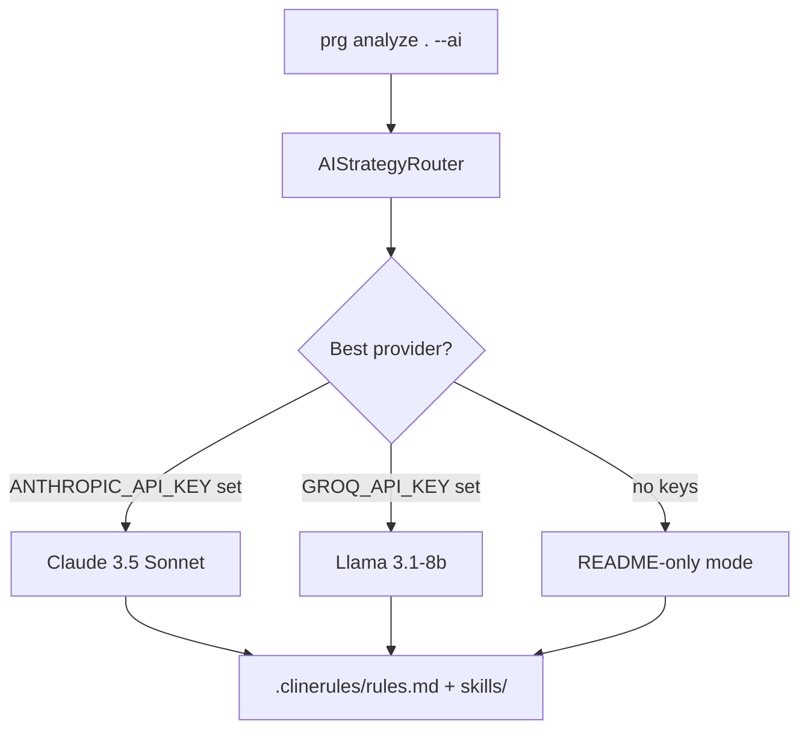

# Project Rules Generator 🚀

> **The First AI That Learns Your Coding Style**

[](https://python.org)
[](LICENSE)
[](tests/)

Most rule generators give you static templates. **Project Rules Generator (PRG)** reads your code, understands your architecture, and **learns from your patterns** to create smarter, context-aware `.clinerules` for any AI agent (Claude, Cursor, Windsurf, Gemini).

---

## Table of Contents
- [Features](#features)
- [Quick Start](#quick-start)
- [Installation](#installation)
- [AI Providers](#ai-providers)
- [Usage](#usage)
- [How It Works](#how-it-works)
- [Recent Changes](#recent-changes)
- [Contributing](#contributing)

---

## Features
- **Context Awareness**: Reads your README & structure instead of using generic templates.
- **Memory**: Learns across ALL projects, not just one.
- **Expert Skills**: Generates advanced rules like "Optimize FFmpeg for ML" instead of just "Use React".
- **Smart Router**: Auto-selects the best available AI provider with graceful fallback.
- **Git Integration**: Auto-commits changes with smart `.gitignore` handling.
- **Constitution**: Automatically generates project `constitution.md` principles.
- **Incremental**: Fast! Updates only changed files or skills.
- **Context Optimization**: Smart `.clinerules.yaml` exclusions.

---

## Quick Start
Get PRG running and generate your basic project rules in your current directory:

```bash
project-rules-generator .
```
*This generates `.clinerules/rules.md` with your file structure and basic patterns in ~200ms.*

---

## Installation

### Prerequisites
- Python 3.11 or higher
- Git

### From Source (Current)
```bash
git clone https://github.com/Amitro123/project-rules-generator
cd project-rules-generator
pip install -e .
```

Verify the installation:
```bash
prg --version
```

---

## AI Providers

PRG supports **4 AI providers** with automatic smart routing. No key required for README-only mode.

| Provider | Quality | Speed | Key Variable | Key Prefix |
|----------|---------|-------|--------------|------------|
| **Anthropic** (Claude 3.5 Sonnet) | ⭐95 | 65 | `ANTHROPIC_API_KEY` | `sk-ant-...` |
| **OpenAI** (GPT-4o-mini) | ⭐90 | 70 | `OPENAI_API_KEY` | `sk-...` |
| **Gemini** (2.0 Flash) | ⭐85 | 85 | `GEMINI_API_KEY` | — |
| **Groq** (Llama 3.1-8b) | ⭐75 | 95 | `GROQ_API_KEY` | `gsk_...` |

**Auto-detection**: PRG reads your env vars and picks the best available provider automatically.

```bash
# Set one or more keys — PRG handles the rest
export ANTHROPIC_API_KEY=sk-ant-...
export GROQ_API_KEY=gsk_...
```

```bash
# Check which providers are ready
prg providers list

# Run a live connectivity test
prg providers test
```

> See [docs/llm-router.md](docs/llm-router.md) for full routing configuration.

---

## Usage

### 1. AI-Powered Custom Skills
Uses the **best available AI provider** to deeply understand your project and generate custom skills.

```bash
# Auto-select best provider
prg analyze . --ai

# Force a specific provider
prg analyze . --ai --provider anthropic
prg analyze . --ai --provider openai
prg analyze . --ai --provider groq

# Control selection strategy
prg analyze . --ai --strategy quality     # highest-quality provider first
prg analyze . --ai --strategy speed       # fastest provider first
prg analyze . --ai --strategy provider:anthropic  # always use anthropic
```

### 2. Create a Skill
Generate a named skill from your project context or README.

```bash
# From README (no API key required)
prg analyze . --create-skill "dom-manipulation" --from-readme README.md

# With AI (uses smart router)
prg analyze . --create-skill "dom-manipulation" --ai

# With a specific provider
prg analyze . --create-skill "dom-manipulation" --ai --provider anthropic
```

### 3. Incremental Update ⚡
Updates only what has changed since the last run. Perfect for CI/CD.

```bash
prg analyze . --incremental
```

### 4. Constitution Mode 📜
Generates a `constitution.md` with your project's core coding principles.

```bash
prg analyze . --constitution
```

### 5. Autopilot 🤖
Full autonomous mode: discover, plan, execute — all with git safety.

```bash
prg autopilot .
```

### 6. Provider Management
```bash
prg providers list                 # Rich table of all providers
prg providers test                 # Live connectivity + latency
prg providers test --provider groq # Test a specific provider
prg providers benchmark            # Rank by quality/speed composite
```

---

## How It Works

PRG operates on a 3-layer architecture for skill resolution:
1. **Project** (`.clinerules/skills/project/`): High priority overrides.
2. **Global Learned** (`~/.project-rules-generator/learned/`): Your personal library.
3. **Builtin** (`~/.project-rules-generator/builtin/`): Default best practices.



### Output Structure
All generated files are consolidated into a single `.clinerules/` directory:
```text
.clinerules/
├── rules.md              # Main rules (from any mode)
├── constitution.md       # Code principles (when --constitution)
├── clinerules.yaml       # Lightweight YAML skill references
├── auto-triggers.json    # Skill activation trigger phrases
└── skills/
    ├── project/          # Project-specific overrides (Highest Priority)
    ├── learned/          # Global learned skills (Medium Priority)
    └── builtin/          # Core PRG skills (Lowest Priority)
```

---

## Recent Changes

### v1.4.1 — Dynamic AI Router
- **4 providers**: Anthropic (Claude 3.5 Sonnet), OpenAI (GPT-4o-mini), Gemini 2.0 Flash, Groq Llama 3.1
- **Smart routing**: `--strategy auto/speed/quality/provider:X` with automatic fallback
- **`prg providers`**: New `list`, `test`, `benchmark` subcommands
- **Auto-detect**: API key prefix detection (`sk-ant-` → Anthropic, `gsk_` → Groq, `sk-` → OpenAI)
- **Config**: `~/.prg/ai_strategy.yaml` for per-task provider preferences
- **28 new tests** — 465 total passing

### v1.2
- **Bug fixes** (Issue #17): 5 bugs fixed in the Skills Mechanism
- **Design improvements**: `QualityReport` unified to single source.
- **New tests**: 10 focused regression tests.

### v1.1
- **Skills cleanup**: Removed 2 legacy files (`skills_generator.py`, `skill_matcher.py`).
- **New `utils/`**: `tech_detector.py` + `quality_checker.py`.
- **Strategy Pattern**: `create_skill()` complexity reduced by 73%.

> See [`CHANGELOG.md`](CHANGELOG.md) for full details.

---

## Contributing
We welcome contributions!
1. Fork the repo
2. Create your feature branch (`git checkout -b feat/amazing-feature`)
3. Run tests before committing (`pytest`)
4. Commit your changes (`git commit -m "feat: add amazing feature"`)
5. Push to the branch and open a PR.

---

**Project Rules Generator** — Because generic "analyze code" skills aren't enough anymore.